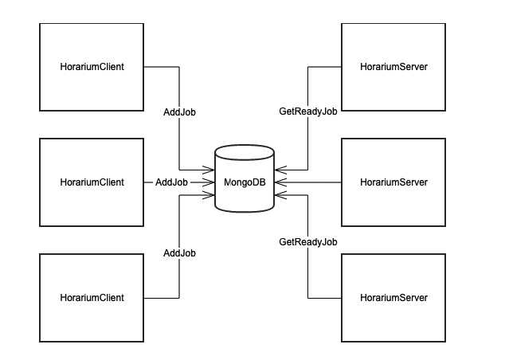

# Horarium

[](https://cloud.drone.io/TinkoffCreditSystems/Horarium)
[](https://www.nuget.org/packages/Horarium)

Horarium is an open source job scheduling .NET library with an easy to use API, that can be integrated within applications of any scale - from the smallest stand-alone application to the largest e-commerce system.

Horarium is fully based on an asynchronous work model, it allows you to run hundreds of parallel jobs within a single application instance. It supports jobs execution in distributed systems and uses MongoDB as a synchronization backend.

Horarium supports .NET Core/netstandard 2.0 and .NET Framework 4.6.2 and later.

Support Database

| Database   | Support                                                            |
| ---------- | ------------------------------------------------------------------ |
| MongoDB    | Yes                                                                |
| In Memory  | No [#5](https://github.com/TinkoffCreditSystems/Horarium/issues/5) |
| PostgreSQL | No [#6](https://github.com/TinkoffCreditSystems/Horarium/issues/6) |

## Getting started

Add nuget-package Horarium

```bash
dotnet add package Horarium
dotnet add package Horarium.Mongo
```

Add job that implements interface ```IJob<T>```

```csharp
    public class TestJob : IJob<int>
    {
        public async Task Execute(int param)
        {
            Console.WriteLine(param);
            await Task.Run(() => { });
        }
    }
```

Create ```HorariumServer``` and schedule ```TestJob```

```csharp
var horarium = new HorariumServer(MongoRepositoryFactory.Create("mongodb://localhost:27017/horarium"));
await horarium.Create<TestJob, int>(666)
        .Schedule();
```

## Add to ```Asp.Net core``` application

Create ```JobFactory```  for instantiating jobs with DI

```csharp
public class JobFactory : IJobFactory
{
    private readonly IServiceProvider _serviceProvider;

    public JobFactory(IServiceProvider serviceProvider)
    {
        _serviceProvider = serviceProvider;
    }

    public object CreateJob(Type type)
    {
        return _serviceProvider.GetService(type);
    }

    public IDisposable BeginScope()
    {
        return _serviceProvider.CreateScope();
    }
}
```

Register Horarium in DI

```csharp
services.AddSingleton<IHorarium>(serviceProvider =>
                new HorariumServer(MongoRepositoryFactory.Create("mongodb://localhost:27017/horarium"),
                    new HorariumSettings()
                    {
                        JobFactory = new JobFactory(serviceProvider)
                    });)
```

Inject interface ```IHorarium``` into Controller

```csharp

private readonly IHorarium _horarium;

public HomeController(IHorarium horarium)
{
    _horarium = horarium;
}

[Route("api")]
public class HomeController : Controller
{
    [HttpPost]
    public async Task Run(int count)
    {
            await _horarium.Create<TestJob, int>(count)
                          .Schedule();
    }
}
```

## Create Recurrent Job

Add job that implements interface ```IJobRecurrent```

```csharp
public class TestRecurrentJob : IJobRecurrent
    {
        public Task Execute()
        {
            Console.WriteLine("Run -" + DateTime.Now);
            return Task.CompletedTask;
        }
    }
```

Schedule ```TestRecurrentJob``` to run every 15 seconds

```csharp
await horarium.CreateRecurrent<TestRecurrentJob>(Cron.SecondInterval(15))
                .Schedule();
```

## Create sequence of jobs

Sometimes you need to create sequence of jobs, where every next job would run if and only if previous job succeeds. If any job of the sequence fails next jobs won't run

```csharp
await horarium
    .Create<TestJob, int>(1) // 1-st job
    .Next<TestJob, int>(2) // 2-nd job
    .Next<TestJob, int>(3) // 3-rd job
    .Schedule();
```

## Distributed Horarium



Horarium has two types of workers: server and client. Server can run jobs and schedule new jobs, while client can only schedule new jobs.

Horarium guarantees that a job would run **exactly once**

## Things to watch out for

Every Horarium instance consults MongoDB about new jobs to run every 100ms (default), thus creating some load on the DB server. This interval can be changed in ```HorariumSettings```